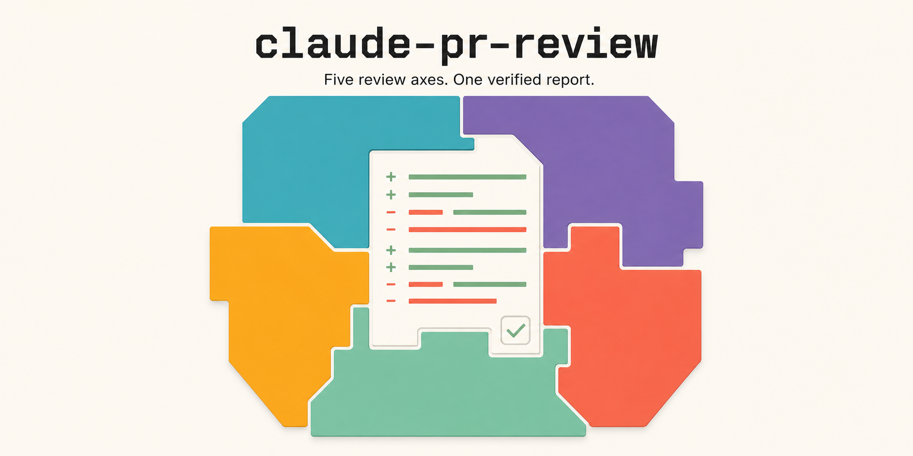

# claude-pr-review



Multi-axis PR review orchestration for [Claude Code](https://docs.anthropic.com/en/docs/claude-code) — one `/pr-review <PR-URL>` command that runs up to five independent review perspectives against the same pull request, cross-verifies every finding between axes, and compiles a single comparison report with copy-paste-ready inline comments.

Built and battle-tested over months of daily production PR review. Extracted from the author's personal setup; see [Prerequisites](#prerequisites) honestly before expecting it to run as-is.

**Why this design** — the methodology behind the command, told through real catches and misses (a dead Save button four reviewers missed, red-team refutation rates, why consensus still gets verified): [一個模型不夠：五軸交叉審的 code review 工作流](https://gggodlin.github.io/blog/one-model-not-enough/) (zh-TW). The article states the three design philosophies; this repo is the implementation, and has kept evolving since it was written (formal-spec gate, provenance discipline, Codex presets came later) — where they differ, the command file is current.

## Why multi-axis

A single reviewer — human or model — has a single blind spot profile. This command deliberately combines perspectives with *different* blind spots:

| Axis | Runtime | Perspective |
|---|---|---|
| Context-aware reviewers | Claude Code subagents (`agents/`) | Language/domain specialists with full repo search access — catch cross-file gaps |
| Codex neutral | `codex review` (bare CLI) | Diff-only, no context — reads the PR the way a reviewer reads a PR email |
| Codex adversarial | Codex plugin red-team template | Actively attacks the change — catches fail-open, visibility, day-boundary hazards |
| Gemini Flash | `agy` CLI (permanent axis) | Cheap independent pass — has repeatedly caught the only confirmed finding in a round |
| Gemini Pro | `agy` CLI (opt-in) | Deeper but hallucination-prone — off by default |

The design principle borrowed from security auditing: **the agent that finds an issue never verifies it**. Context-aware findings are verified by the diff-only axis and vice versa (symmetric cross-verification), consensus findings still get a convention-baseline check, and no finding is ever dropped — refuted ones ship in the report with both sides' evidence so the human makes the final call.

## What you get

- **Coverage as set arithmetic, not trust** — every changed file must be explicitly accounted for (`finding` / `REVIEWED_NO_ISSUES` / `INTENTIONALLY_SKIPPED`), asserted deterministically after review
- **Deterministic re-anchoring** — findings carry verbatim source anchors and are re-located by exact match before the report, so line numbers survive model drift
- **Provenance discipline** — on hotfix→staging PRs, files inherited from the default branch are detected and capped so their defects don't land on an innocent author
- **Severity calibration gates** — Must Fix requires a concrete user-visible repro path *and* a shippable-thing broken; severity built on unverified premises gets recomputed without them
- **A formal-spec compliance lane (experimental)** — normative spec clauses (MUST/SHALL, invariants, formulas) are extracted, canonicalized by a deterministic reducer (`scripts/pr-review-c4.py`), and traced against authored hunks with full hash binding
- **Traditional Chinese comparison report** with colloquial, paste-ready inline comment blocks (the command's working language is bilingual zh-TW/English; reports render in zh-TW — fork and adjust if you want another language)

## Repo layout

```
commands/pr-review.md            the orchestrator command (install → ~/.claude/commands/)
agents/*.md                      five reviewer subagents + one rubric auditor (install → ~/.claude/agents/)
scripts/pr-review-c4.py          deterministic spec-clause reducer
scripts/poll-liveness.sh         background-process poll helper (3-signal: done/dead/stuck)
scripts/sem-pr-blast-radius.sh   entity-level dependency blast radius (needs `sem`)
references/severity-calibration.md      security impact×likelihood matrix
references/finding-severity-rules.md    6c/6d gates: Must/Should/Nice calibration (platform-neutral SSOT)
skills/bitbucket-pr-review/      optional Bitbucket adapter, read path (GitHub needs none of this — `gh` covers it)
skills/bitbucket-pr-mutation/    optional Bitbucket adapter, write path (proposal/approval-gated, contract-tested)
```

Install: see [INSTALL.md](INSTALL.md) — an agent-executable guide (point Claude Code at it and say "set me up for my configuration"). Everything lands under `~/.claude/`; the command references its helpers at `~/.claude/scripts/...` and `~/.claude/skills/...` at runtime.

**Minimum install (GitHub-only)** = `commands/` + `agents/` + `references/` + `scripts/` — the command dispatches reviewers by the agent names defined in `agents/`, reads both reference files during severity calibration, and probes the bundled scripts at fixed steps (they self-skip when their underlying tool is absent, but the files must exist for the skip to be graceful). `skills/bitbucket-*` only if you review Bitbucket PRs.

## Prerequisites

Tiered honestly — the command degrades gracefully when an axis is missing (it reports the gap instead of failing the review):

**Required**
- Claude Code with subagent support; `gh` CLI for GitHub PRs
- A local clone of the repo under review (the command builds a temporary `git worktree` pinned to the PR head — the single most important mechanism here; stale local state silently invalidates an entire review)

**Per-axis (optional, skip = axis skipped)**
- Codex axes: OpenAI Codex CLI + the Codex Claude Code plugin
- Gemini axes: `agy` (Google Antigravity CLI) with a signed-in account
- Blast radius: [`sem`](https://github.com/Ataraxy-Labs/sem) indexed for your repo
- React mechanical axis: `npx react-doctor` (auto-skipped on non-React PRs)

**Bitbucket only**
- An Atlassian API token (app passwords are dead since mid-2026, CHANGE-3222); configure your email + workspace per `skills/bitbucket-pr-review/SKILL.md`

## Caution

- The Codex sections mutate `~/.codex/config.toml` during a run (MCP strip + effort override, pristine-backup + restore). Read Step 3 and Step 7 before first use.
- `skills/bitbucket-pr-mutation` is the only write path to Bitbucket and is deliberately ceremony-heavy (typed approval, proposal hashing, read-back). Its contract tests also pin the command's Step 8 wording — run `cd skills/bitbucket-pr-mutation/scripts && python3 -m unittest discover -s tests -q` after editing either file.
- Costs are real: a default-preset run of a mid-size PR spends tens of minutes wall-clock and millions of Codex tokens. Presets (`light` / `sol-lite`) exist for a reason.

## License

MIT
